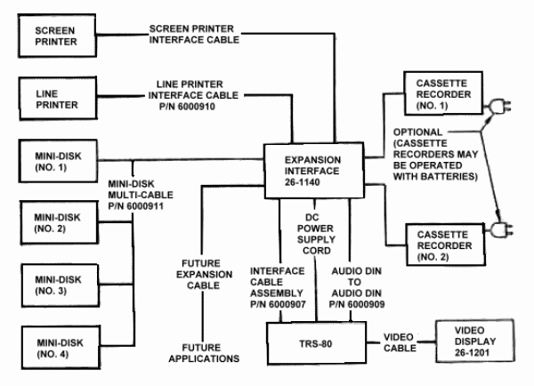

# Conclusion

Possibly, you will not need all of the expansion modules that are available but, we have supplied you with Hoods for cable connectors for a complete expansion system. Use the Hoods as illustrated to prevent accidental mismatch between the edge connectors on the PCB and the cable connectors.

In the event that you lose a Door or Hood and want to replace it, we have given you a Parts List. You may refer to the Parts List and exploded diagrams to determine its Part Number. You can order replacement parts through your local Radio Shack store.

You must have a LEVEL II BASIC [model_number] Microcomputer to utilize the [model_number] Expansion Interface, the Line Printer and the Mini-Disk modules. If you have a LEVEL I BASIC machine, it must be modified to accept LEVEL II programs. The Screen Printer is the only expansion module that may be connected directly to the [model_number] Microcomputer and that will operate with LEVEL I machines.

We are continually improving and updating our [model_number] Microcomputer System. You will be kept informed through our Newsletters (you are on the mailing list), addenda and revisions to the Manual.

For the complete Electrical Connections Block Diagram, see Figure 7.

FIGURE 5. Rear View—Interface Connections.

FIGURE 6. Placement of Expansion Interface. 

TRS-80 Microcomputer System Without Expansion Interface. 

[model_number] Microcomputer System with Expansion Interface (maximum system).
FIGURE 7. Electrical Connections Block Diagram. [model_number] Microcomputer System with Expansion Interface (maximum system).

