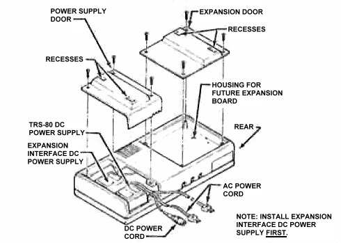
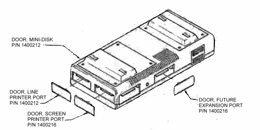

# Setting Up

## Power Supplies and PCB Housing 

Remove the Power Supply Door (top right side). First connect one DC power cord (DIN connector) to the Power connector on the PCB. Now install the two DC Power Supplies as illustrated. Route the remaining cords out the rear of the case. Be sure the power cords are seated in the door cutouts before replacing the Door.

To gain access to the future expansion PCB Housing, remove the Expansion Door from the top left side of the module.

FIGURE 2. Power Supplies and Future Expansion PCB Locations.

INSTALL EXPANSION INTERFACE DC POWER SUPPLY FIRST.
 

The term "port" as used in this manual refers to the openings into which the Cable connectors are inserted to provide an interconnection between the [model_number] and the Expansion Interface modules.
 

The ports, with the exception of the Expansion Interface port, are also covered by removable Doors. To remove these Doors, press on the right side of the Door and it will pivot slightly. Grasp the left side of the Door and pull out (see Figure 3 for locations).

FIGURE 3. Expansion Interface, Front View—Doors Removed. 
